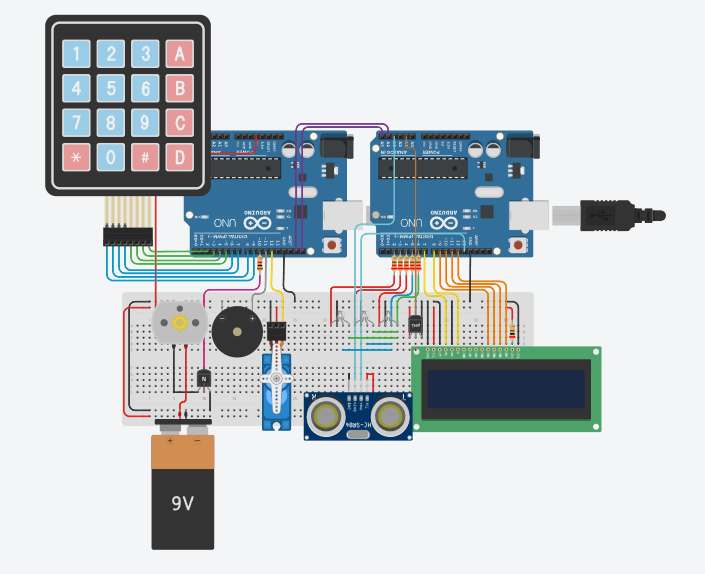
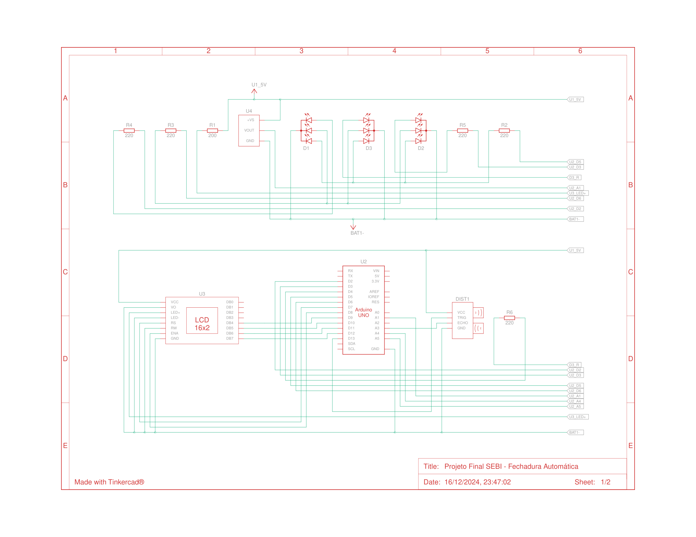

# Fechadura Automática Arduino

Este projeto consiste na criação de uma fechadura automática utilizando Arduinos e diversos sensores. Foi desenvolvido como projeto final da disciplina de Sistemas Embarcados da **ETEC Prof. Horácio Augusto da Silveira**.

## 🛠️ Funcionalidades
- Tranca e destranca uma porta mediante senha correta.
- Exibe falhas em LEDs RGB e ativa um alarme após três tentativas incorretas.
- Detecta presença para ativar o sistema e exibe mensagens no display LCD.
- Mede a temperatura ambiente.

## 🚀 Componentes Utilizados
- 2 Arduinos Uno R3
- 1 teclado 4x4
- 1 bateria 9V
- 1 display LCD
- 1 sensor de temperatura
- 3 LEDs RGB
- 1 buzzer
- 5 resistores de 200Ω e 1 resistor de 1kΩ
- 1 micro servo
- 1 motor CC
- 1 transistor
- 1 protoboard grande
- 1 sensor de distância ultrassônico
- Diversos cabos de conexão

## 📜 Manual de Usuário
Consulte o arquivo [`docs/manual.md`](docs/manual.md) para instruções detalhadas de uso.

## 📷 Esquema do Circuito

## 🌐 Link para o Projeto no Tinkercad
Acesse o projeto no Tinkercad [aqui](https://www.tinkercad.com/things/9pD70zoJXGh-projeto-final-sebi-fechadura-automatica/editel?sharecode=GcYOzYtr4Cu_uegFV6Hz6SHH51iFGnT9zcrj3Pb7gPc).

Este projeto está licenciado sob a licença [MIT](LICENSE).

## 🔗 Referências
- Teclado 4x4: [Link](https://www.tinkercad.com/things/iGxovc3JQVe-keypad-4x4-arduino)
- Comunicação Serial: [Link](https://www.udesc.br/arquivos/cct/documentos/_Hands_On____Arduino_UNO___Arduino_Mega___Protocolo_I2C___i9___N_cleo_Estudantil_de_Inova__o_Tecnol_gica_15244942814491_1944.pdf)

---

Projeto desenvolvido por **Débora Vieira Gomes** e **Luiz Henrique de Santana**.
